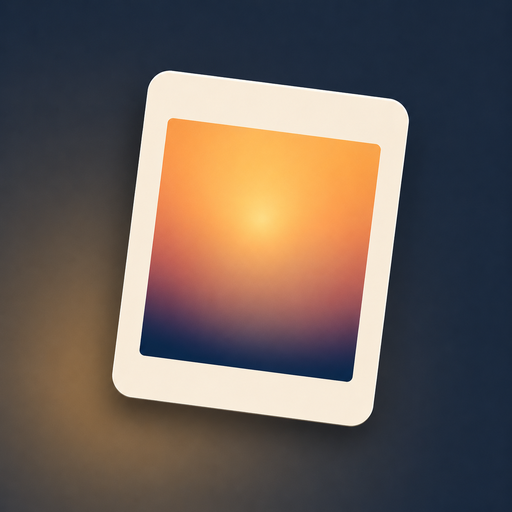

# tumble

  

**A slower camera you can actually own.**

Tumble is a tiny lock-screen camera that makes you wait to see what you shot. Twelve shots a day, shake to develop, and a Drawer of prints that age. No account, no cloud, no social.

[**Join the waitlist at gettumbleapp.com**](https://gettumbleapp.com)

---

## The Ritual

Tumble is built around a limit, not an algorithm. It turns the camera back into a small ritual instead of another infinite surface.

### 1. The Roll
**Twelve shots a day. No more.**
The limit is the point. When you know you only have twelve, you look a little longer before you pull the trigger. The roll resets at midnight.

### 2. The Wait
**Prints start blank. Shake to develop.**
You don't see what you shot immediately. Prints land in your Drawer as blank exposures. To see them, you have to work for it—physically shake your phone to bring the image to the surface.

### 3. The Drawer
**A pile of prints that age.**
There is no grid and no feed. Your photos live in a scattered pile. Over time, the prints age—developing grain, vignette, and a physical patina that reflects how long they've been kept.

### 4. Private & Local
**On-device. No subscriptions.**
No account to create. No cloud to sync to. No analytics tracking your eye movement. Everything stays on your hardware. You buy the app once, and you own it forever.

---

## Current Status

Tumble is currently in the quiet window before launch.

*   **iOS:** The native app is built and currently in **Apple Review**.
*   **Android:** Feature-parity native app is ready and planned for the **same launch window**.
*   **Web:** Waitlist site is live. Subscribers get the App Store and Google Play links first.

---

*Tumble — Wait for it.*
